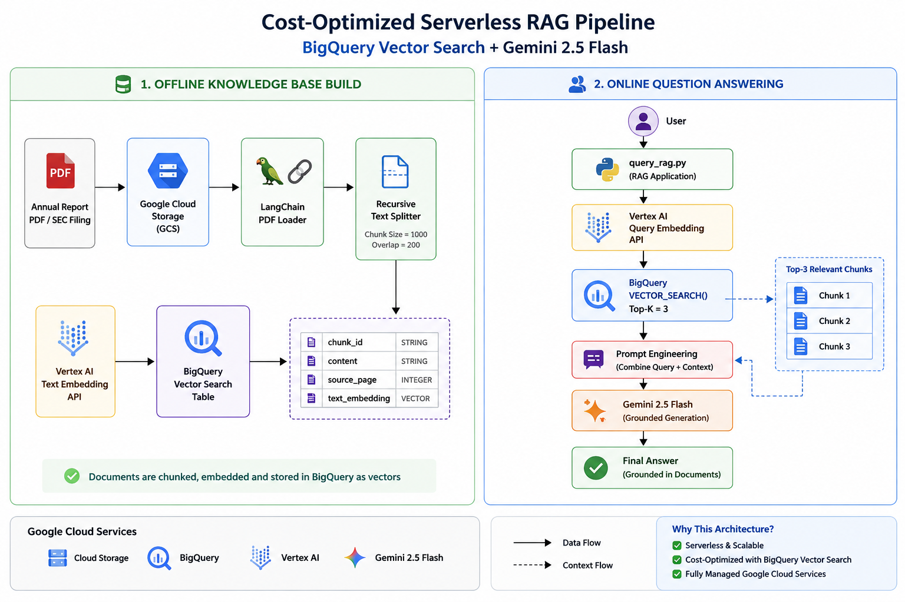

# 🚀 Cost-Optimized Serverless RAG Pipeline using BigQuery Vector Search & Gemini


A production-style **Retrieval-Augmented Generation (RAG)** application built on **Google Cloud Platform** that performs semantic search over financial documents using **BigQuery Vector Search** and generates grounded answers with **Gemini**.

---

# 📖 Overview

Traditional LLMs answer from their training data, which may be outdated or unaware of private enterprise documents.

This project implements a **Retrieval-Augmented Generation (RAG)** pipeline that:

- 📄 Reads financial reports (Annual Reports / SEC 10-K PDFs)
- ✂️ Splits documents into semantic chunks
- 🧠 Generates embeddings using Vertex AI
- 🗄️ Stores vectors in BigQuery
- 🔍 Retrieves relevant document chunks using Vector Search
- 🤖 Uses Gemini 2.5 Flash to answer only from retrieved context

The architecture is **serverless**, **cost-efficient**, and built entirely on managed Google Cloud services.

---

# 🏗️ Architecture



---

# ✨ Features

- PDF document ingestion
- Intelligent chunking using LangChain
- Vertex AI Text Embedding
- BigQuery Vector Search
- Gemini-powered grounded answers
- Serverless Google Cloud architecture
- Cost-optimized vector database
- Retrieval-Augmented Generation (RAG)

---

# 🛠️ Tech Stack

| Category | Technology |
|----------|------------|
| Language | Python 3.10 |
| Framework | LangChain |
| Embeddings | Vertex AI Text Embedding |
| LLM | Gemini 2.5 Flash |
| Vector Database | BigQuery Vector Search |
| Storage | Google Cloud Storage |
| Cloud | Google Cloud Platform |
| Data Source | Annual Reports / SEC 10-K PDFs |

---

# 📂 Project Structure

```text
Cost-Optimized-Serverless-RAG-BigQuery-Gemini/

│
├── data/
│   └── sample.pdf
│
├── screenshots/
│
├── test_setup.py
├── ingest_data.py
├── embed_and_store.py
├── query_rag.py
│
├── requirements.txt
├── README.md
├── LICENSE
└── .gitignore
```

---

# ⚙️ Installation

Clone the repository

```bash
git clone https://github.com/<your-username>/Cost-Optimized-Serverless-RAG-BigQuery-Gemini.git

cd Cost-Optimized-Serverless-RAG-BigQuery-Gemini
```

Create environment

```bash
conda create -n rag_env python=3.10

conda activate rag_env
```

Install dependencies

```bash
pip install -r requirements.txt
```

Authenticate with Google Cloud

```bash
gcloud auth application-default login

gcloud auth application-default set-quota-project YOUR_PROJECT_ID
```

---

# 🚀 Running the Project

### 1. Test Environment

```bash
python test_setup.py
```

---

### 2. Process PDF

```bash
python ingest_data.py
```

---

### 3. Generate Embeddings

```bash
python embed_and_store.py
```

---

### 4. Ask Questions

```bash
python query_rag.py
```

Example:

```
What is the company's strategy regarding enterprise infrastructure and AI?
```

---

# 🔍 RAG Workflow

```text
Upload PDF

↓

LangChain Loader

↓

Chunk Documents

↓

Vertex AI Embeddings

↓

BigQuery Vector Search

────────────────────

User Question

↓

Query Embedding

↓

VECTOR_SEARCH()

↓

Relevant Chunks

↓

Gemini

↓

Answer
```

---

# 💰 Cost Optimization

This project intentionally avoids expensive dedicated vector databases.

Instead it uses:

- ✅ BigQuery Vector Search
- ✅ Vertex AI Embeddings
- ✅ Serverless Google Cloud Services
- ✅ Batch embedding generation
- ✅ Top-K retrieval to reduce token usage

---

# 📈 Skills Demonstrated

- Retrieval-Augmented Generation (RAG)
- Semantic Search
- Vector Databases
- Prompt Engineering
- Google Cloud Platform
- BigQuery Vector Search
- Vertex AI
- Gemini API
- LangChain
- Data Engineering
- Python

---

# 📸 Demo

Add screenshots here after running the project.

Example:

```
screenshots/

architecture.png

bigquery_table.png

terminal_output.png

final_answer.png
```

---

# 🚀 Future Improvements

- Streamlit UI
- FastAPI REST API
- Hybrid Search
- Metadata Filtering
- Docker Support
- CI/CD using GitHub Actions
- Conversation Memory
- Citation Highlighting
- Multi-document Support

---

# 📜 License

This project is licensed under the MIT License.

---

# 👨‍💻 Author

**Sayan Das**

GitHub: https://github.com/sayan261999

LinkedIn: *(Add your LinkedIn profile here)*